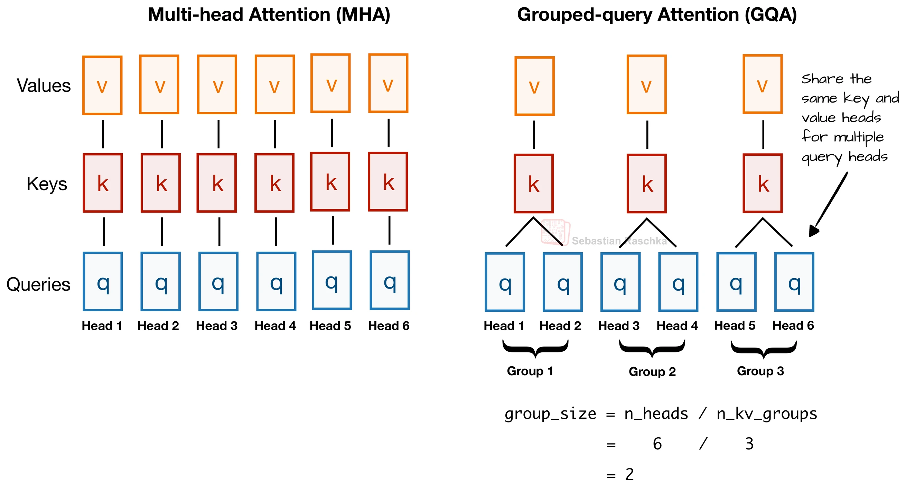
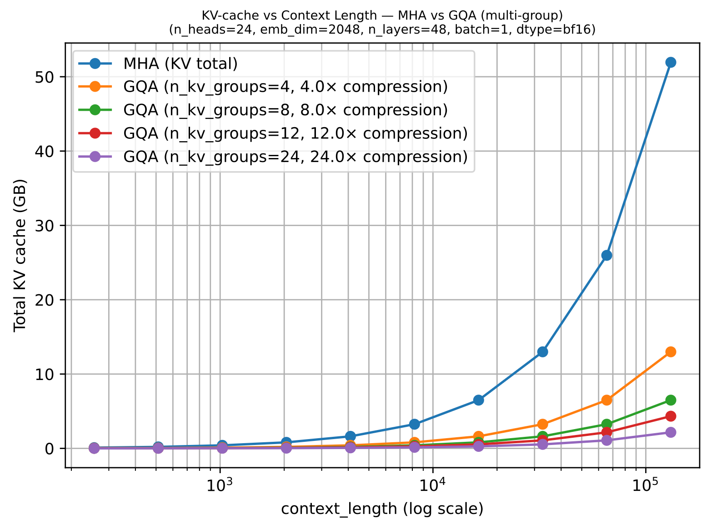

# Grouped-Query Attention

Grouped-Query Attention (GQA) is a commonly used alternative to standard Multi-Head Attention in modern language models. Instead of giving every query head its own key and value heads, GQA lets several query heads share the same keys and values. This reduces memory use and speeds up inference, especially for long contexts. While the idea has existed for a while, it has become more popular as efficiency and deployment costs have become more important. Many recent large language models use GQA or the closely related multi-query attention for these reasons.


Here's a brief GQA summary. Unlike MHA, where each head also has its own set of keys and values, to reduce memory usage, GQA groups multiple heads to share the same key and value projections.


For example, as shown in the figure below, if there are 3 key–value groups and 6 attention heads, then heads 1–2 share one set of keys and values, heads 3–4 share another, and heads 5–6 share a third. This sharing reduces the total number of key and value computations, which lowers memory usage and improves efficiency.



In short, the core idea behind Grouped-Query Attention (GQA) is to reduce the number of key and value heads by sharing them across multiple query heads. This has two main benefits: 
1. it reduces the model’s parameter count, and 
2. it lowers memory bandwidth usage during inference, since fewer key and value tensors need to be stored in and read from the KV cache.


Although GQA is primarily an efficiency-focused modification of Multi-Head Attention, ablation studies (including those in the original GQA paper and the LLaMA 2 paper) show that it performs comparably to standard MHA when configured properly. That said, the number of key–value groups matters: in the extreme case where all query heads share a single key–value group—known as multi-query attention—memory usage is reduced even further, but model quality can degrade. At the other extreme, if the number of key–value groups equals the number of query heads, GQA reduces back to standard multi-head attention.

## Simplified Implementation

[gqa_simple.ipynb](gqa_simple.ipynb) contains a very simple and basic implementation of the GQA mechanism. It's isolated from the rest of the GPT model and is performed on random QKV tensors.

## GQA Memory Savings

The memory savings are mostly reflected in the KV storage. We can compute the KV storage size with the following formula:

bytes ≈ batch_size × seqlen × (embed_dim / n_heads) × n_layers × 2 (K,V) × bytes_per_elem × n_kv_heads

You can use the [memory_estimator_gqa.py](memory_estimator_gqa.py) script in this folder to apply this for different model configs to see how much memory you can save by using GQA over MHA:

```bash
uv run memory_estimator_gqa.py --emb_dim 4096 --n_heads 32 --n_layers 32 --context_length 32768 --n_kv_groups 4 --batch_size 1 --dtype bf16
==== Config ====
context_length   : 32768
emb_dim          : 4096
n_heads          : 32
n_layers         : 32
n_kv_groups      : 4
batch_size       : 1
dtype            : bf16 (2 Bytes/elem)
head_dim         : 128
GQA n_kv_heads   : 8

==== KV-cache totals across all layers ====
MHA total KV cache  : 17.18 GB
GQA total KV cache  : 4.29 GB
Ratio (MHA / GQA)   : 4.00x
Savings (GQA vs MHA): 75.00%
```

The plot of total KV cache vs context length shows how much memory we save with GQA over MHA:


You can reproduce the plot via `uv run plot_memory_estimates_gqa.py`.

The savings when using GQA over MHA are further shown in the plot below for different key-value group sizes as a function of the context length:


## GQA Code Examples
The [gpt_with_kv_mha.py](gpt_with_kv_mha.py) and [gpt_with_kv_gqa.py](gpt_with_kv_gqa.py) scripts in this folder provide hands-on examples for comparing the MHA and GQA memory usage in the context of a GPT model implementation.

Note that GQA is also used in the Llama 3, Gemma 3, and Qwen3 bonus materials. However, for simplicity, the code scripts in this folder modify the GPT architecture, which traditionally didn't use GQA.

Note that the model is not trained and thus generates nonsensical text. However, you can use it as a drop-in replacement for the standard GPT model in chapters 5-7 and train it.